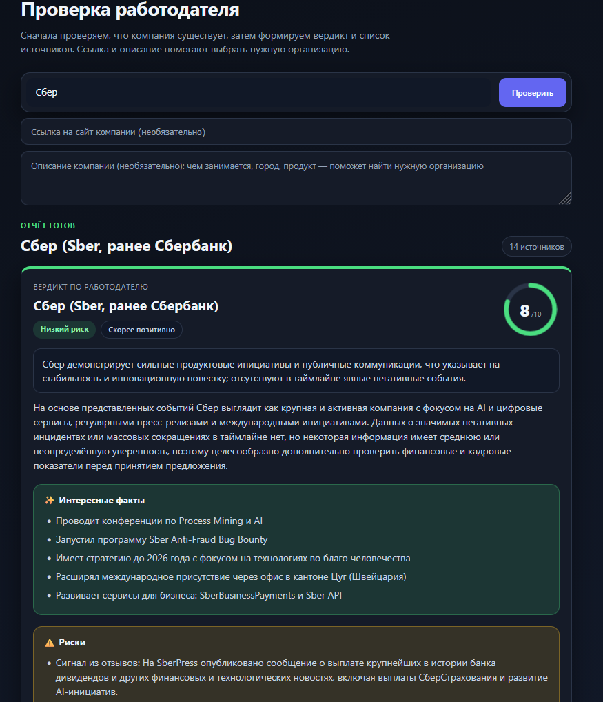
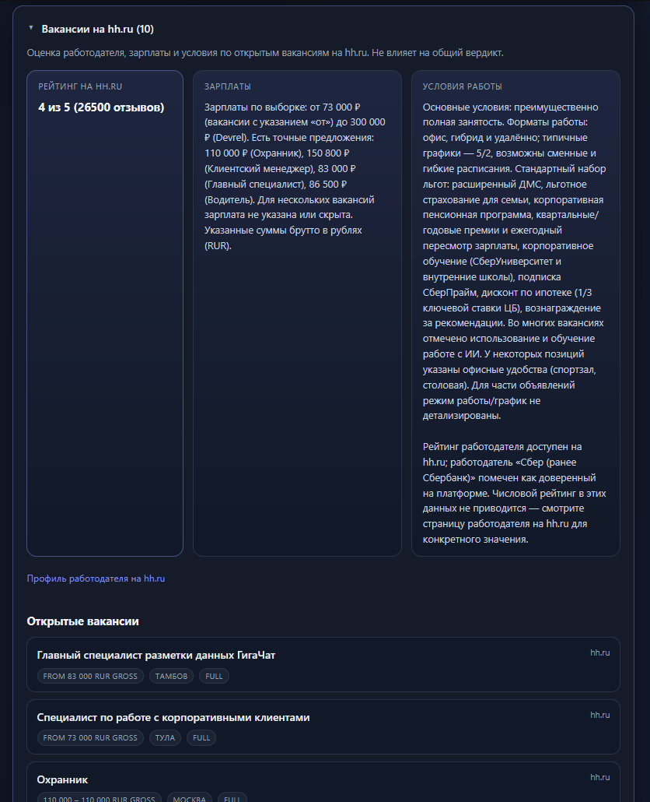
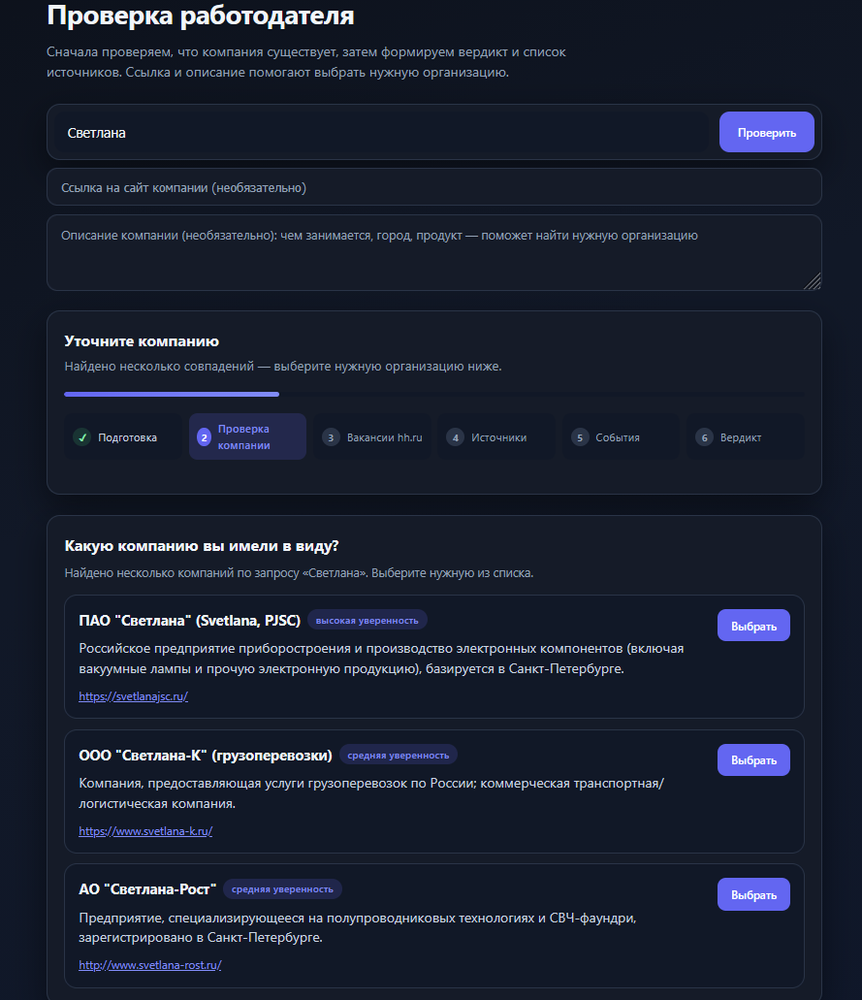
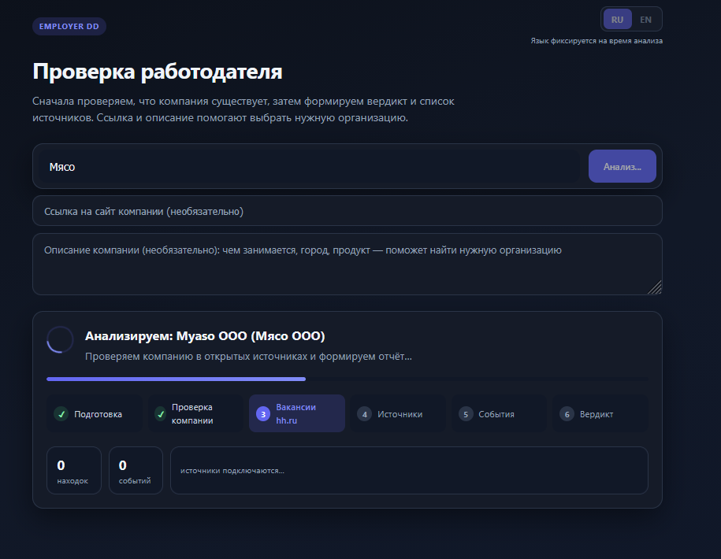
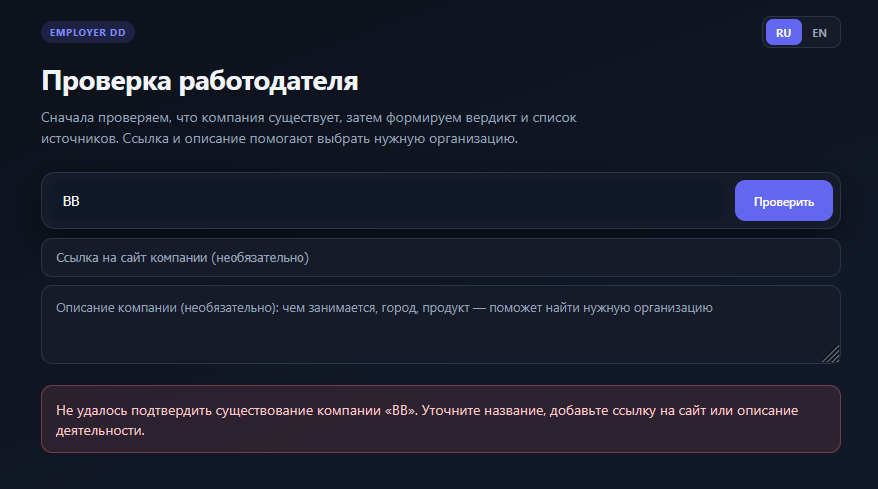
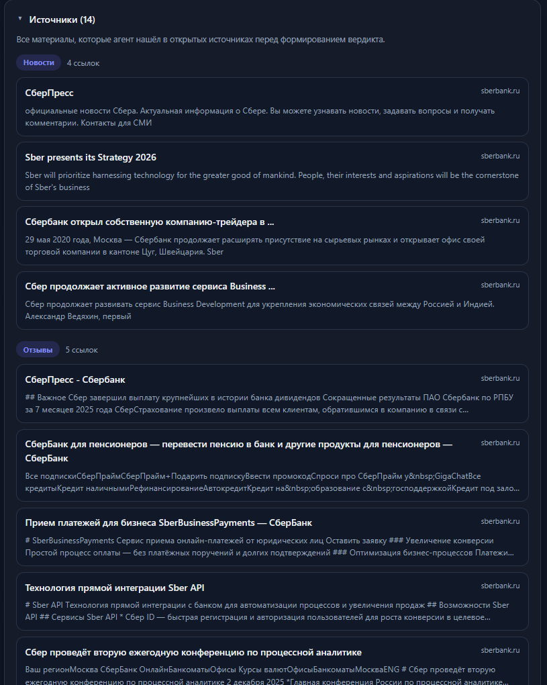

# Employer Due Diligence Agent

AI-сервис для проверки работодателя перед собеседованием. Вы вводите компанию — система собирает открытые сигналы, строит хронологию и выдает итоговый вердикт с рисками, красными флагами и ссылками на источники.

Стек: LangGraph + FastAPI + React. Интерфейс и ответы поддерживают русский и английский языки.

---

## Что умеет продукт

- Разрешает неоднозначные названия компаний (human-in-the-loop выбор кандидата).
- Анализирует вакансии HH.ru отдельным блоком: зарплаты, формат работы, рейтинг работодателя.
- Запускает агентный ресерч по новостям/отзывам/фактам компании.
- Собирает структурированные события и объединяет их в единую timeline.
- Формирует итоговый verdict (оценка 1–10, summary, risks, red flags, interesting facts).
- Показывает все использованные источники, чтобы можно было вручную проверить выводы.

---

## Как работает агент (end-to-end)

```text
1) resolve_identity
   └─ если найдена неоднозначность: статус awaiting_input и выбор компании в UI
2) analyze_hh_vacancies
   └─ отдельный HH-блок до основного supervisor-цикла
3) supervisor + tools loop
   └─ поисковые/исследовательские вызовы
4) structure_events
5) merge_timeline
6) generate_verdict
```

Порядок узлов зафиксирован в пайплайне:
- `resolve_identity → analyze_hh_vacancies → supervisor → ... → generate_verdict`

---

## Архитектура

```text
┌───────────────────────────────────────────────────────────────────────────┐
│ React UI (RU/EN, progress, identity picker, HH panel, verdict dashboard) │
└───────────────────────────────┬───────────────────────────────────────────┘
                                │ HTTP
┌───────────────────────────────▼───────────────────────────────────────────┐
│ FastAPI                                                                    │
│ POST /runs · GET /runs/{id} · POST /runs/{id}/identity · POST /runs/{id}/ │
│ hh-search · POST /runs/{id}/resume · GET /health                           │
└───────────────────────────────┬───────────────────────────────────────────┘
                                │
┌───────────────────────────────▼───────────────────────────────────────────┐
│ LangGraph research pipeline                                                │
│ resolve_identity → analyze_hh_vacancies → supervisor/tools loop →          │
│ structure_events → merge_timeline → generate_verdict                       │
└───────────────────────────────┬───────────────────────────────────────────┘
                                │
┌───────────────────────────────▼───────────────────────────────────────────┐
│ External services: Tavily, LLM provider (OpenRouter/OpenAI/Google),      │
│ HH.ru API + website fallback, optional Langfuse                           │
└───────────────────────────────────────────────────────────────────────────┘
```

---

## Скриншоты интерфейса

### 1. Итоговый дашборд (verdict + sources)


### 2. Блок HH.ru анализа вакансий


### 3. Экран выбора компании при неоднозначности


### 4. Карточка прогресса выполнения run


### 5. Ошибка: компания не подтверждена


### 6. Блок источников (sources)


---

## Быстрый старт

### Требования

- Python 3.12+
- [uv](https://docs.astral.sh/uv/)
- Node.js 20+
- Ключи: минимум один LLM-провайдер + Tavily

### Установка и запуск

```bash
git clone <your-repo-url>
cd deep_resaerch
cp .env.example .env
./start.sh
```

Приложение будет доступно на `http://127.0.0.1:8000`.

### One-shot CLI прогон

```bash
uv run python scripts/e2e_run.py "Яндекс"
```

---

## Конфигурация (`.env`)

| Variable | Required | Description |
|----------|----------|-------------|
| `OPENROUTER_API_KEY` | one of LLM keys | Основной LLM-провайдер |
| `OPENAI_API_KEY` | one of LLM keys | Альтернативный LLM-провайдер |
| `GOOGLE_API_KEY` | one of LLM keys | Альтернативный LLM-провайдер |
| `TAVILY_API_KEY` | yes | Веб-поиск для ресерча |
| `LLM_MODEL` | no | Переопределение модели (по умолчанию `openai:gpt-5-mini`) |
| `HH_API_USER_AGENT` | recommended | User-Agent для HH API (формат: `App/1.0 (email)`) |
| `LANGFUSE_PUBLIC_KEY` | no | Langfuse observability |
| `LANGFUSE_SECRET_KEY` | no | Langfuse observability |
| `LANGFUSE_BASE_URL` | no | Пример: `https://us.cloud.langfuse.com` |
| `LANGFUSE_RELEASE` | no | Метка релиза для трейсинга |

### Важно про HH.ru

- Если `api.hh.ru` отвечает `403 forbidden`, система использует fallback через публичные web-страницы HH.
- Повторный поиск работодателя доступен прямо из UI и через API (`POST /runs/{run_id}/hh-search`).

---

## API

| Method | Path | Description |
|--------|------|-------------|
| `GET` | `/health` | Проверка здоровья сервиса |
| `POST` | `/runs?background=true` | Старт асинхронного исследования |
| `GET` | `/runs/{run_id}` | Статус и результат run |
| `POST` | `/runs/{run_id}/identity` | Подтверждение компании после disambiguation |
| `POST` | `/runs/{run_id}/hh-search` | Ручной retry HH employer search |
| `POST` | `/runs/{run_id}/resume` | Возобновление прерванного run |

Пример старта run:

```bash
curl -X POST "http://127.0.0.1:8000/runs?background=true" \
  -H "Content-Type: application/json" \
  -d '{"company_name":"Яндекс","response_language":"ru"}'
```

---

## Feature tour в UI

1. **Company form** — ввод названия, URL и контекста компании.
2. **Progress card** — текущая фаза пайплайна, статус выполнения.
3. **Identity picker** — появляется, если найдено несколько кандидатов компании.
4. **Verdict card** — итоговая оценка, ключевые риски и выводы.
5. **HH vacancies panel** — отдельный анализ рынка найма компании на HH.
6. **Source links** — все найденные источники для проверки выводов.
7. **Language lock** — язык run фиксируется во время выполнения, чтобы избежать смешивания RU/EN в одном отчете.

---

## Разработка

```bash
uv sync
uv run pytest
cd src/frontend && npm install && npm run dev
uv run uvicorn backend.main:app --reload
```

---

## Структура проекта

```text
src/agents/      # LangGraph пайплайн и доменная логика агентов
src/backend/     # FastAPI API + жизненный цикл run
src/frontend/    # React UI
tests/           # Unit/integration tests
scripts/         # CLI сценарии
eval/datasets/   # Golden fixtures for merge quality tests
```
